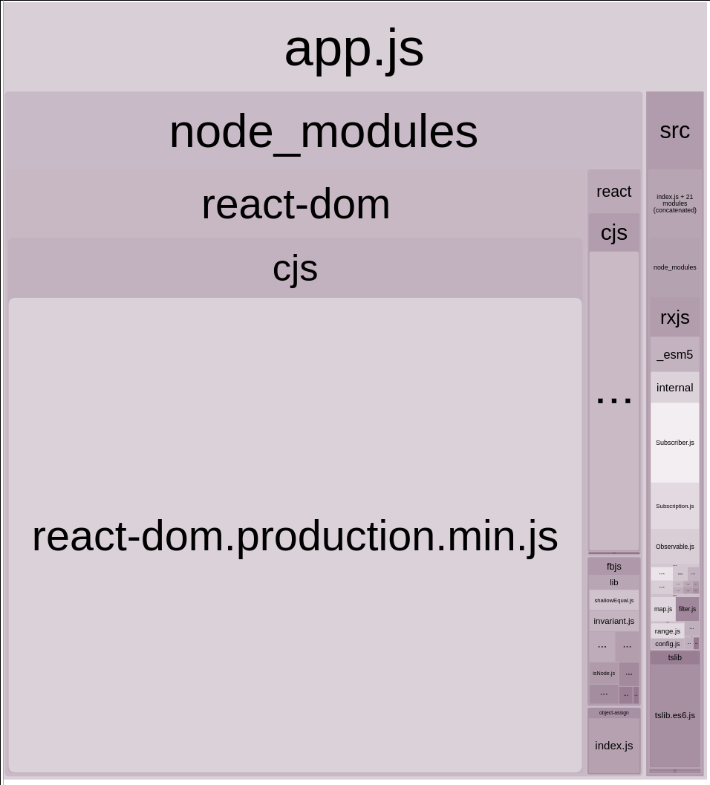

# Tree Shaking
Example of an app relying on tree-shaking, [rxjs](https://github.com/ReactiveX/rxjs) is used to show how Webpack is able only bundle the operators that are used in the code.

This relies on the library (rxjs) setting `sideEffects: false` in their `package.json`.

# How to run
1. Usual `npm i`
2. `npm run analyze` shoud open a browser with the following:

# Result

^^^ This shows how "small" rxjs is compared to React, only the operators used in src/index.js are included in the bundle.
